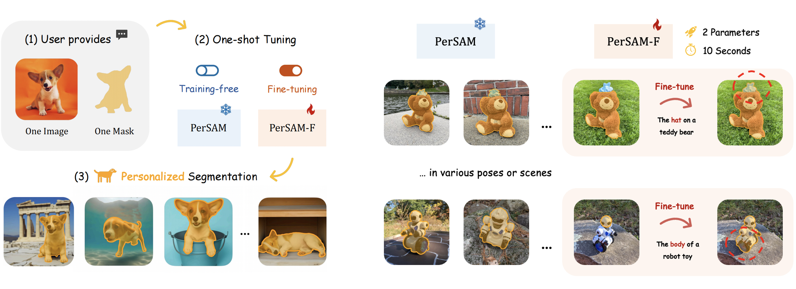
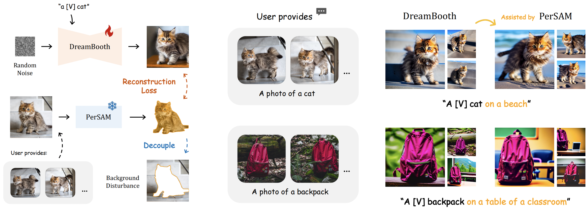

# Personalize Segment Anything Model in 10 Seconds

Official implementation of ['Personalize Segment Anything Model with One Shot'](https://github.com/ZrrSkywalker/Personalize-SAM/blob/main/paper_arXiv.pdf).

## News
* TODO: Release the PerSAM-assisted [Dreambooth](https://arxiv.org/pdf/2208.12242.pdf) for better fine-tuning [Stable Diffusion](https://github.com/CompVis/stable-diffusion) 📌.
* We release the code of PerSAM and PerSAM-F 🔥.
* We release a new dataset for personalized segmentation, [PerSeg]() 🔥.

## Introduction
*How to customize SAM to automatically segment your pet dog in a photo album?*

In this project, we propose a training-free **Per**sonalization approach for [Segment Anything Model (SAM)](https://ai.facebook.com/research/publications/segment-anything/), termed as **PerSAM**. Given only a single image with a reference mask, PerSAM can segment specific visual concepts, e.g., your pet dog, within other images or videos without any training. 
For better performance, we present an efficient one-shot fine-tuning variant, **PerSAM-F**. We freezing the entire SAM and introduce two learnable mask weights, which only trains **2 parameters** within **10 seconds**. 

<div align="center">
   <br>
</div>

Besides, our approach can be utilized to assist [DreamBooth](https://arxiv.org/pdf/2208.12242.pdf) in fine-tuning better [Stable Diffusion](https://github.com/CompVis/stable-diffusion) for personalized image synthesis. We adopt PerSAM to segment the target object in the user-provided few-shot images, which eliminates the **background disturbance** and benefits the target representation learning.

<div align="center">
   <br>
</div>

## Requirements
### Installation
Clone the repo and create a conda environment:
```bash
git clone https://github.com/ZrrSkywalker/Personalize-SAM.git
cd Personalize-SAM

conda create -n persam python=3.8
conda activate persam

pip install -r requirements.txt
```

Similar to Segment Anything, our code requires `pytorch>=1.7` and `torchvision>=0.8`. Please follow the instructions [here](https://pytorch.org/get-started/locally/) to install both PyTorch and TorchVision dependencies.


### Preparation
Please download our constructed dataset **PerSeg** for personalized segmentation from [here](), and the pre-trained weights of SAM from [here](https://dl.fbaipublicfiles.com/segment_anything/sam_vit_h_4b8939.pth). Then, unzip the dataset file and organize them as
```
data/
|–– Annotations/
|–– Images/
sam_vit_h_4b8939.pth
```

## Getting Started

### Personalized Segmentation

For the training-free 🧊 **PerSAM**, just run:
```bash
python persam.py --outdir <output filename>
```

For 10-second fine-tuning of 🚀 **PerSAM-F**, just run:
```bash
python persam_f.py --outdir <output filename>
```

After running, the output masks and visualzations will be stored at `<output filename>`. 

Then, for mIoU evaluation, please run:
```bash
python eval_mioU.py --pred_path <output filename>
```

### Personalized Stable Diffusion
Our approach can enhance DreamBooth to better personalize Stable Diffusion for text-to-image generation.

Comming soon.

## Acknowledgement
This repo benefits from [Segment Anything](https://github.com/facebookresearch/segment-anything) and [DreamBooth](https://github.com/XavierXiao/Dreambooth-Stable-Diffusion). Thanks for their wonderful works.

## Contact
If you have any question about this project, please feel free to contact zhangrenrui@pjlab.org.cn.
